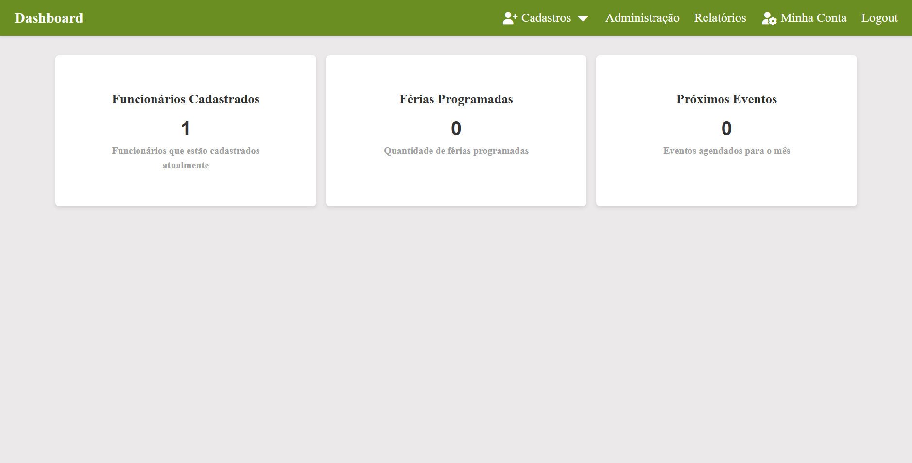
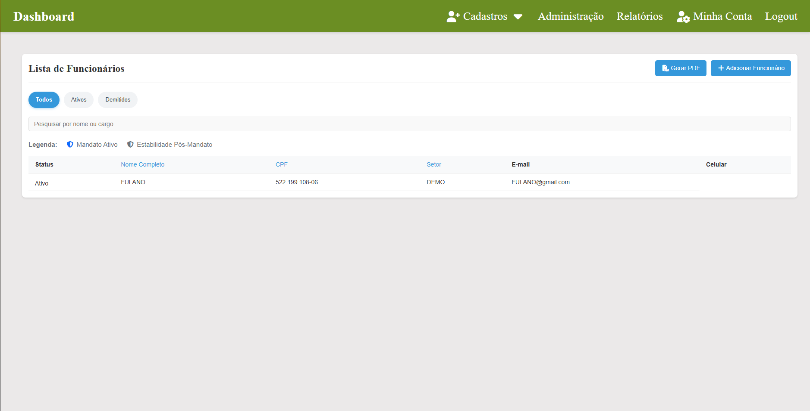
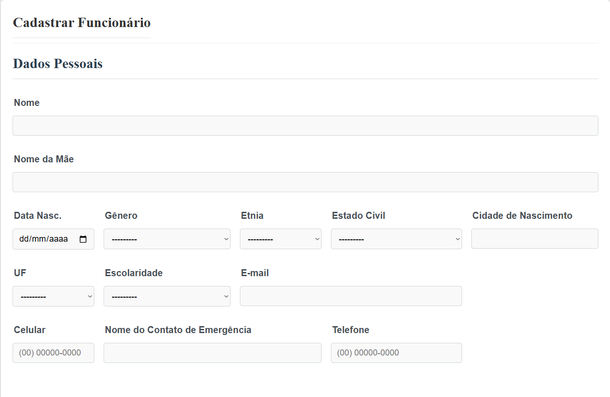
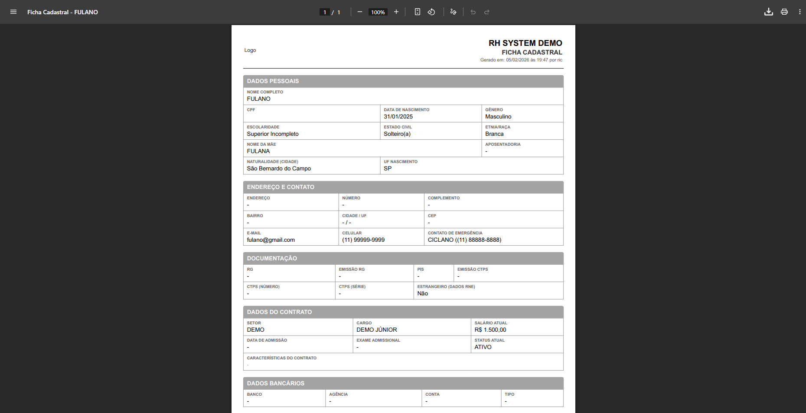

# Projeto RH


## 💻 Sobre o Projeto

O **ProjetoRH** é uma solução web desenvolvida para modernizar o departamento pessoal. O objetivo foi criar um sistema robusto que substituísse planilhas manuais, centralizando dados de colaboradores e automatizando a burocracia.

---
## 📸 Tour pelo Sistema

### 1. Visão Geral (Dashboard)
Painel administrativo com métricas rápidas e atalhos para as principais funções do RH.

<div align="center">
  
</div>

<br>

### 2. Gestão de Colaboradores
Listagem completa com filtros dinâmicos, busca inteligente e indicadores visuais de status (Ativo/Inativo).
<div align="center">
  
</div>

<br>

### 3. Cadastro Completo e Validado
Formulário robusto dividido em seções lógicas (Dados Pessoais, Contratuais, Bancários), com validações de CPF e regras de negócio integradas.
<div align="center">
  
</div>

<br>

### 4. O Diferencial: Documentação Automática
Apenas um clique gera a **Ficha Cadastral** completa em PDF. O layout foi desenhado com CSS específico para impressão (Paged Media), garantindo economia de tinta e clareza visual.
<div align="center">
  
</div>

---

## 🛠 Tecnologias Utilizadas

| Categoria | Tecnologias |
| :--- | :--- |
| **Back-end** | Python 3, Django Framework |
| **Banco de Dados** | SQLite (Dev) / PostgreSQL (Produção) |
| **Relatórios** | WeasyPrint, Django Templating |
| **Front-end** | HTML5, CSS3, JavaScript (Máscaras e Interatividade) |
| **Infraestrutura** | Google Cloud Platform (VM), Nginx, Gunicorn |

---

## 🚀 Como rodar o projeto localmente

Siga os passos abaixo para testar o sistema na sua máquina:

```bash
# 1. Clone este repositório
git clone [https://github.com/ricardoaufe/ProjetoRH.git](https://github.com/ricardoaufe/ProjetoRH.git)

# 2. Entre na pasta do projeto
cd ProjetoRH

# 3. Crie e ative o ambiente virtual
python -m venv .venv
# Windows: .venv\Scripts\activate
# Linux/Mac: source .venv/bin/activate

# 4. Instale as dependências
pip install -r requirements.txt

# 5. Aplique as migrações ao banco de dados
python manage.py migrate

# 6. Crie um superusuário (Para acessar o sistema)
python manage.py createsuperuser
# Siga as instruções para definir e-mail e senha.

# 7. Inicie o servidor
python manage.py runserver

# 8. Acesse o sistema em:
http://127.0.0.1:8000 #Use o login e senha criados no passo 6.

```

## 💡 Aprendizados e Desafios

Durante o desenvolvimento, os principais desafios superados foram:

Deploy em Nuvem: Configuração de servidor Linux (Ubuntu) no Google Cloud, configurando Gunicorn e Nginx do zero para rodar a aplicação em produção.

Manipulação de PDF: Configurar o WeasyPrint para renderizar HTML/CSS de forma precisa e organizada para impressão, criando documentos oficiais.

Criar a lógica do funcionamento de 


---

## 📞 Contato
Minhas informações caso queira conversar!

LinkedIn: https://www.google.com/search?q=https://www.linkedin.com/in/ricardo-ferreira-8b5145371
<br>
Email: rasf0831@gmail.com
